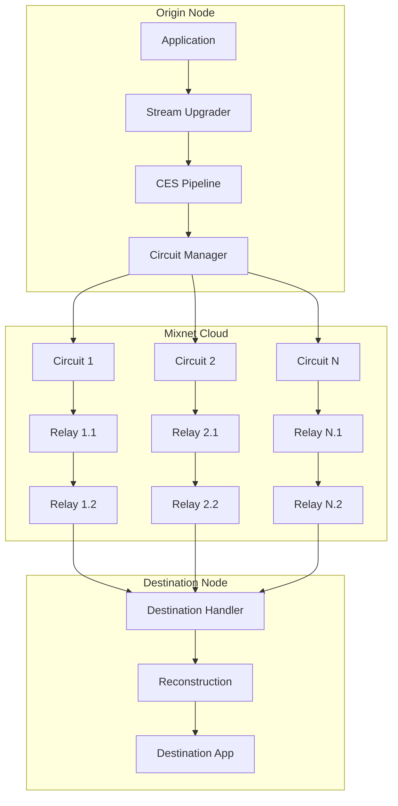

# Lib-Mix: Metadata-Private Communication for libp2p

Lib-Mix is a high-performance, sharded, configurable-hop mixnet protocol for
libp2p that provides metadata-private communication at near-wire speeds.

## Overview

Lib-Mix addresses the fundamental trade-off between privacy and performance in
decentralized applications. By using multi-path sharding and configurable onion
routing, it enables metadata-blind communication without the massive latency
overhead typical of traditional mixnets.

### Key Features

- **Transport Agnostic**: Works over any libp2p transport (QUIC, TCP, WebRTC).
- **Multi-Path Sharding**: Data is split into multiple shards sent over independent circuits, improving throughput and resilience.
- **Configurable Onion Routing**: Support for 1-10 hops, allowing developers to tune the privacy-performance trade-off.
- **Erasure Coding**: Uses Reed-Solomon coding to allow reconstruction even if some shards or circuits fail.
- **Layered Encryption**: Each hop is protected by Noise-based layered encryption.
- **Metadata Privacy**: Relays have no knowledge of the origin, destination, or content of the traffic.

## How the protocol works

The implementation in `mixnet/` follows a repeatable flow for every outbound
message:

1. **Configuration**: `DefaultConfig` or `NewMixnetConfig` defines how many
   hops, circuits, and privacy features are enabled.
2. **Runtime construction**: `NewMixnet` wires together the circuit manager,
   relay discovery, relay handler, CES pipeline, metrics, and resource manager.
3. **Relay discovery**: candidate relays are sampled and filtered so that the
   sender can build circuits without reusing the destination or local peer.
4. **Circuit establishment**: one or more circuits are created, each containing
   `HopCount` relays. The runtime connects to the entry hop for every circuit.
5. **Session setup**: the destination receives or derives session key material
   used to protect the payload end-to-end.
6. **Payload processing**: if CES is enabled, data is compressed, encrypted,
   and sharded. If CES is disabled, the runtime still encrypts the payload and
   evenly splits it across the available circuits.
7. **Privacy wrapping**: every shard is wrapped in privacy metadata, optional
   header padding, and optional authenticity tags before it is sent.
8. **Relay forwarding**: each relay only unwraps the routing information needed
   to identify the next hop and forwards the shard onward.
9. **Destination reconstruction**: the destination collects enough shards to
   meet the reconstruction threshold, verifies tags when enabled, decrypts the
   session payload, and delivers the recovered bytes to the application.

This layered flow is why the codebase is split into `config.go`,
`upgrader.go`, `stream.go`, `privacy_transport.go`, `circuit/`, `relay/`,
`discovery/`, and `ces/`.

## Architecture

Lib-Mix operates as a stream upgrader in the libp2p stack.



## Usage

### As an Origin (Sender)

```go
import (
    "github.com/libp2p/go-libp2p/mixnet"
)

// Configure the mixnet.
cfg := mixnet.DefaultConfig()
cfg.HopCount = 3
cfg.CircuitCount = 5

// Initialize the runtime.
m, err := mixnet.NewMixnet(cfg, host, routing)
if err != nil {
    panic(err)
}

// Send a single payload privately.
err = m.Send(ctx, destinationPeerID, []byte("Hello, private world!"))
```

### As a Stream Origin

```go
stream, err := m.OpenStream(ctx, destinationPeerID)
if err != nil {
    panic(err)
}
defer stream.Close()

if _, err := stream.Write([]byte("Hello over MixStream")); err != nil {
    panic(err)
}
```

### As a Destination (Receiver)

```go
// Wait for an inbound mixnet session that was opened by a remote peer.
stream, err := m.AcceptStream(ctx)
if err != nil {
    panic(err)
}
defer stream.Close()

buf := make([]byte, 4096)
n, err := stream.Read(buf)
if err != nil {
    panic(err)
}
```

## Configuration

The `MixnetConfig` allows fine-tuning the protocol:

| Option | Default | Description |
|--------|---------|-------------|
| `HopCount` | 2 | Number of relays in each circuit (1-10) |
| `CircuitCount` | 3 | Number of parallel circuits to establish (1-20) |
| `Compression` | "gzip" | Compression algorithm ("gzip" or "snappy") |
| `SelectionMode` | "rtt" | Relay selection strategy ("rtt", "random", or "hybrid") |
| `ErasureThreshold` | 60% | Number of shards required to reconstruct data |
| `HeaderPaddingEnabled` | `true` | Adds randomized header padding to reduce size fingerprinting |
| `MaxJitter` | `50` | Adds up to 50 ms of random delay between shard transmissions |

## Package Structure

- [`README.md`](../../README.md): package guide and documentation map for the
  `mixnet/` folder.
- [`project-structure.md`](project-structure.md): file-by-file guide to the
  implementation tree.
- [`ces/`](../../ces/): Compress-Encrypt-Shard pipeline.
- [`circuit/`](../../circuit/): Circuit management and onion routing logic.
- [`discovery/`](../../discovery/): Relay discovery via DHT.
- [`relay/`](../../relay/): Relay node packet handling.

## Documentation map

- [`../PRD/design.md`](../PRD/design.md): end-to-end protocol design and flow.
- [`../PRD/configuration-reference.md`](../PRD/configuration-reference.md):
  configuration defaults, trade-offs, and presets.
- [`circuit-readme.md`](circuit-readme.md): circuit lifecycle details.
- [`relay-readme.md`](relay-readme.md): relay-side forwarding model.
- [`discovery-readme.md`](discovery-readme.md): relay discovery details.
- [`ces-readme.md`](ces-readme.md): data transformation pipeline.

## License

Lib-Mix is part of `go-libp2p` and is licensed under the same terms.
